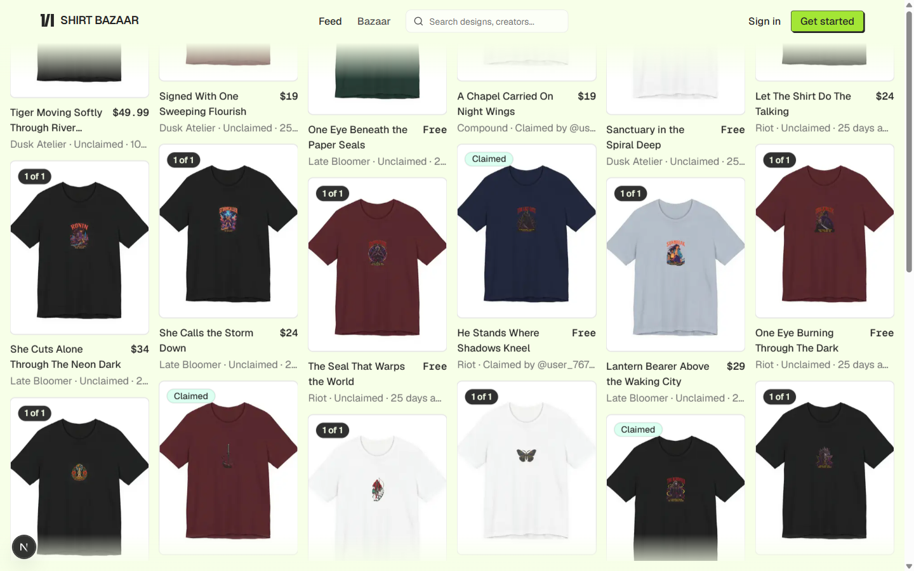
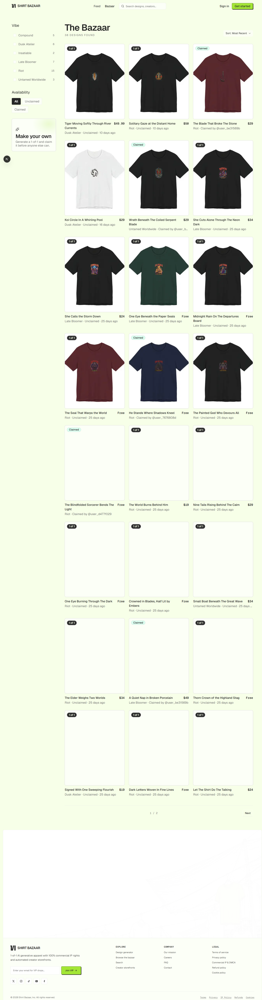
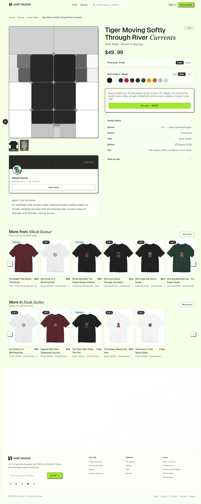
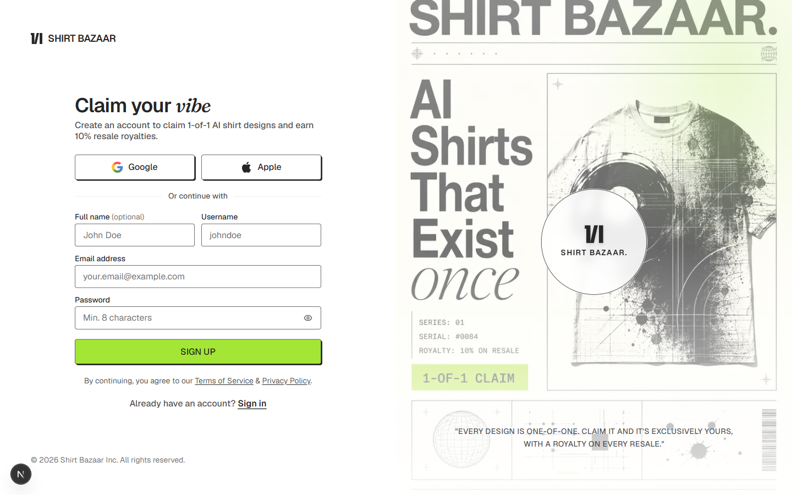

# Shirt Bazaar

Type a prompt. Get a shirt design that will only ever exist once. Claim it and it's permanently yours — full commercial IP, your own creator storefront, a cut of every future resale.

Shirt Bazaar is a Next.js 16 / Supabase marketplace for 1-of-1 AI-generated apparel: generate → list → claim (claiming *is* buying) → auto-provisioned storefront → Printify print-on-demand fulfillment, with Bolt handling checkout.

## Screenshots

| Home feed | The Bazaar (shop) |
|---|---|
|  |  |

| Design detail | Sign up |
|---|---|
|  |  |

Captured live against a local dev build on 2026-09-03. No screen recording is included — these are static captures taken with a browser automation tool, which can't drive a screen recorder. If you want a walkthrough video, `npm run dev` and record your own; the flows worth capturing are generate → list → claim (`/create`) and a storefront visit (`/creator/<handle>`).

## How it works

1. **Generate** (`/create`, signed-in only): prompt + style + optional persona → one AI-generated design (MuAPI `gpt-image-2`), polled to completion.
2. **List or claim**: the maker prices it (or leaves it free).
3. **Claim = buy**: a database row lock makes claiming atomic and single-buyer, forever. Priced claims go through Bolt's hosted checkout; free ones claim instantly.
4. **Storefront**: claiming auto-provisions a page at `/creator/<handle>` on the claimer's first claim.
5. **Fulfillment**: the claimer can order a printed copy through Printify.

Full technical walkthrough with diagrams: [`docs/ARCHITECTURE.md`](docs/ARCHITECTURE.md).

## Tech stack

Next.js 16 (App Router, Turbopack) · React 19 · TypeScript · Tailwind CSS 4 + shadcn/ui · Supabase (Postgres + RLS + Auth + Storage) · MuAPI (image + text generation) · OpenRouter (persona vision) · Printify (fulfillment) · Bolt (payments) · Resend/Gmail (email)

## Getting started

```bash
npm install
cp .env.example .env.local   # fill in values, see below
npm run dev                  # http://localhost:3000 (pass -p to use another port)
```

### Minimum to boot

Only Supabase credentials are required for the app to start:

```
NEXT_PUBLIC_SUPABASE_URL=
NEXT_PUBLIC_SUPABASE_ANON_KEY=
SUPABASE_SERVICE_ROLE_KEY=
```

Everything else in `.env.example` degrades gracefully when unset (see the comments in that file, or the config table in [`docs/TRD.md`](docs/TRD.md#3-environment-configuration)):
- No `MUAPI_API_KEY` → generation fails outright (this is the core feature — set it early).
- No Printify vars → designs show a drawn mockup, no real products/orders.
- No Bolt vars → free claims work, priced claims refuse cleanly.
- No email vars → purchases still complete, just no receipt email.

### Database

Apply the migrations in `supabase/migrations/` in order (hand-written SQL, no ORM) to a Supabase project, then point the env vars above at it.

### Useful scripts

- `node scripts/generate-designs.ts` — generates real catalog designs (there's no seed fixture; every listing is actually generated).
- `node scripts/printify-catalog.mjs` — prints your shop's blueprint/print-provider/variant IDs once `PRINTIFY_API_TOKEN` is set.

### Tests

```bash
npm test        # ~24 files, run directly via tsx — no test framework
npm run lint
npm run typecheck
```

## Documentation

| Doc | Covers |
|---|---|
| [`docs/PRD.md`](docs/PRD.md) | Product requirements, user journeys, feature status, known product risks |
| [`docs/TRD.md`](docs/TRD.md) | Technical requirements, environments, non-functional requirements, tech debt |
| [`docs/ARCHITECTURE.md`](docs/ARCHITECTURE.md) | System design, subsystem walkthrough, sequence diagrams |
| [`docs/DATA_MODEL.md`](docs/DATA_MODEL.md) | Full schema, RLS policies, storage buckets |
| [`docs/API.md`](docs/API.md) | Every route handler and Server Action |
| [`docs/SECURITY.md`](docs/SECURITY.md) | Security review with evidence and severity ratings |
| [`docs/FEATURE_INVENTORY.md`](docs/FEATURE_INVENTORY.md) | Ground-truth feature-by-feature audit of the live app |
| [`docs/GROWTH_AND_RETENTION.md`](docs/GROWTH_AND_RETENTION.md) | Activation/retention audit with prioritized, code-grounded recommendations |
| [`docs/PRODUCTION_PLAN.md`](docs/PRODUCTION_PLAN.md) | Domain cutover, Bolt live mode, paid plans, creator payouts, launch checklist |

## Known limitations (see docs for detail)

- **Royalty ledger has no writer.** The "10% on every resale" promise has no resale mechanism behind it yet — a claim is permanent and singular. See `PRD.md` §7.
- **Garment reorders use a mock payment adapter.** Real Printify order submission is deliberately switched off (`PRINTIFY_SUBMIT_ORDERS=false`) until real payment lands on that path.
- **Open redirect** in the OTP/password-recovery confirm flow — High severity, one-line fix, see `SECURITY.md`.
- **`sharp` is an undeclared dependency** used for watermarking — present only via Next's own `optionalDependencies`, add it explicitly before deploying somewhere that skips optional deps.
- No cart, wishlist, reviews, creator directory, or analytics yet.
