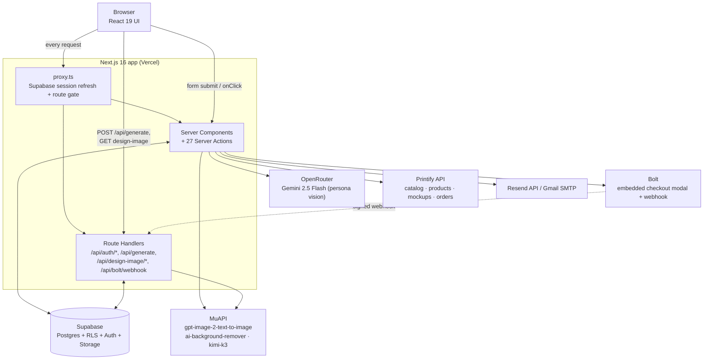
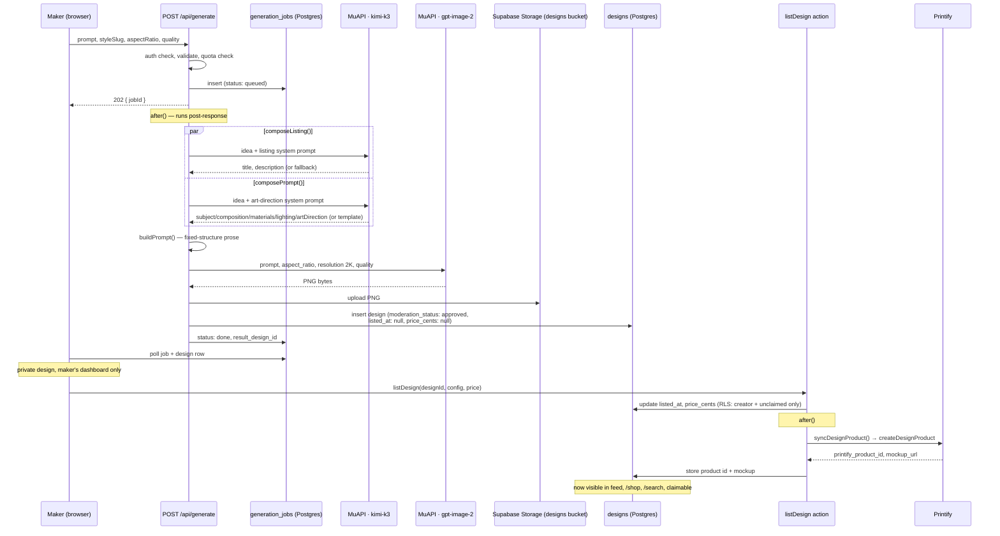
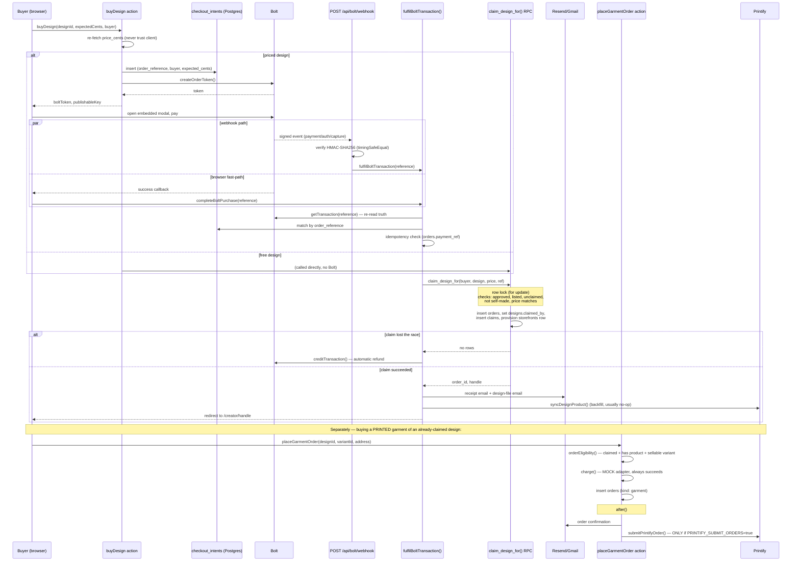

# Architecture

Grounded entirely in the code as of this writing (repo root `E:\Gray Matter Labs\bazaar`, verified live at `http://localhost:3001`). Nothing here is aspirational — where marketing copy claims something the code doesn't do, it's called out explicitly in **Notable Design Decisions**.

## Overview

Shirt Bazaar is a single Next.js 16 (App Router, React 19, Turbopack) application. A user types a prompt, picks an art-direction style, and gets one AI-generated shirt design. The design is private until the maker explicitly lists it (with a price or free); once listed, one buyer can **claim** it — an atomic, one-time, database-enforced transfer of ownership that also auto-provisions the claimant's own creator storefront at `/creator/<handle>`. There is no traditional backend: every mutation is either a Next.js Route Handler (6 of them, `app/api/**/route.ts`) or a Server Action (27 of them, across 17 `"use server"` files) called directly from React components. Postgres (Supabase) is both the database and, via Row-Level Security, a large part of the authorization layer.

## Tech Stack

- **Framework**: Next.js 16.2.6 (App Router, Turbopack, `experimental.serverActions.bodySizeLimit: "10mb"`), React 19.2.4 (`next.config.ts:1-23`)
- **Language**: TypeScript 5, strict mode, path alias `@/*` → repo root (`tsconfig.json`)
- **Styling/UI**: Tailwind CSS 4, shadcn/ui + `@base-ui/react` primitives, `class-variance-authority`, `framer-motion`/`motion` for animation, `recharts` for dashboard charts, `lucide-react` icons
- **Database/Auth/Storage**: Supabase — Postgres with RLS, Supabase Auth (cookie-based via `@supabase/ssr`), Supabase Storage (buckets: `designs`, `avatars`)
- **Image processing**: `sharp` (server-side watermarking) — **not declared in `package.json`**, see Notable Design Decisions
- **Email**: Resend HTTP API, with Gmail SMTP (`nodemailer`) as a stopgap fallback while the sending domain isn't verified
- **External AI**: MuAPI (`api.muapi.ai`) — one account/key fronting `gpt-image-2-text-to-image` (image generation), `ai-background-remover`, and `kimi-k3` (text: listing copy, prompt art-direction, storefront theming); OpenRouter (`google/gemini-2.5-flash`) for persona reference-image analysis only
- **Fulfillment**: Printify API (product creation, catalog, mockups, order submission)
- **Payments**: Bolt (embedded-modal card payments, HMAC-signed webhook) for buying a design; a hand-rolled mock adapter (`lib/payments/checkout.ts`) still stands in for garment reprint orders
- **Testing**: no framework — `npm test` runs ~23 files straight through `npx tsx`, each with its own inline assertions (see `package.json:13`)

## Directory Map

```
app/
  (auth)/        login, signup, forgot-password, reset-password[/confirm], verify-otp
  (legal)/       cookies, ip-policy, privacy, refund-policy, terms
  (public)/      (home), about, careers, contact, create, creator[/[handle]], design/[id], faq, purchase/success, search, shop
  dashboard/     designs, messages[/[handle]], orders, personas, settings  (+ layout.tsx gate, notifications has actions only, no page)
  actions/       contact.ts, newsletter.ts — the only two Server Actions not colocated with a feature page
  api/           auth/callback, auth/confirm, bolt/webhook, design-image/[id][/original], generate
lib/
  auth/          next-url.ts — safeNext() open-redirect guard
  data/          read-only query layer, one file per surface (bazaar, design, feed, home, storefront, dashboard, orders, messages, notifications, personas, search, settings)
  email/         send.ts (Resend/Gmail transport), templates.ts, layout.ts
  generation/    the AI design pipeline — adapter, muapi transport, compose, prompt, styles, quota, personas
  images/        watermark.ts, storage-path.ts, design-src.ts
  orders/        address.ts, buyer.ts, eligibility.ts — pure validators
  payments/      bolt.ts, bolt-client.ts, checkout.ts (mock), fulfil.ts
  printify/      client.ts, garments.ts, print-areas.ts, products.ts, sync.ts, orders.ts, mockups.ts, tones.ts
  purchase/      buyer-account.ts, deliver.ts
  seo/           design-schema.ts (JSON-LD)
  storefront/    theme.ts, theme-prompt.ts, banner-prompt.ts
  supabase/      client.ts (browser), server.ts (RSC + service-role), middleware.ts, oauth.ts
  royalty.ts, listing.ts, faq.ts, site.ts, utils.ts, hero-draft.ts
components/      shadcn-based UI, feature folders mirroring app/ (home, create, design, dashboard, storefront, bazaar, layout)
supabase/migrations/  8 dated SQL files, hand-written (no ORM)
proxy.ts         repo-root middleware entry (see below)
compose-live.mts run lib/generation/compose.ts against a real prompt from the CLI, outside Next
```

## Core Subsystems

### Auth (`lib/auth/`, `lib/supabase/`)

Session state is Supabase Auth via cookies (`@supabase/ssr`). `proxy.ts:1-12` is the middleware entry point (Next 16 renamed `middleware.ts` → `proxy.ts`; the matcher excludes static assets and images). It delegates entirely to `lib/supabase/middleware.ts:6-61`'s `updateSession()`, which:
1. Refreshes the session cookie on every request (Server Components can only read cookies, not write them — the refresh has to happen here).
2. Gates two prefixes as protected (`/dashboard`, `/create` — `lib/supabase/middleware.ts:65`): no session → redirect to `/signup` (from `/create`, the new-visitor entry point) or `/login`, carrying `?next=`.
3. Gates `/login`/`/signup` as auth routes: an existing session bounces away via `safeNext()`.

`/create` sits in the `(public)` route group for its navbar/footer chrome only — the comment at `lib/supabase/middleware.ts:63-64` is explicit that this is not a public route. Route handlers and Server Actions are **not** covered by this middleware; each checks `supabase.auth.getUser()` individually (or relies on RLS). `lib/auth/next-url.ts`'s `safeNext()` is the one choke point every auth redirect's `?next=` passes through, rejecting absolute/protocol-relative/backslash targets — except `/api/auth/confirm`'s `next` param, which bypasses it (flagged in `docs/API.md`, carried into this doc's risk list below).

Three client constructors exist for three trust levels (`lib/supabase/client.ts`, `lib/supabase/server.ts:5-29,38-44`): browser client (anon key, user's own cookies), server client (anon key + RLS, used in Server Components/Actions under the visitor's session), and service-role client (`createServiceClient()`, bypasses RLS entirely — only ever constructed in trusted server code that already knows who it's acting for: the generation worker, Printify sync, Bolt fulfilment, guest-account minting). The service-role client is rebuilt inline in three separate files rather than imported (`app/api/generate/route.ts:204-210`, `lib/printify/sync.ts:12-18`, `app/(public)/design/[id]/order-actions.ts:84-90`) — flagged with a `ponytail:` comment in `lib/supabase/server.ts:36-37` as a known duplication to fold in later.

### Generation (`lib/generation/`) — the core differentiator

The pipeline behind `POST /api/generate` (`app/api/generate/route.ts`), sole entry point for turning a prompt into a design row.

**Request → job**: validates prompt length (3–1500 chars, `lib/generation/prompt.ts:50-51`), resolves a `StylePreset` (`lib/generation/styles.ts` — presets are code, not a DB table, "a preset absent from the deployed code cannot be generated anyway", `lib/generation/styles.ts:1-18`), validates any style-specific text/quote, checks the daily quota (`lib/generation/quota.ts:33-49`: counts `generation_jobs` rows — not `designs`, and not filtered by success — in the trailing 24h; `DAILY_CAP` defaults to 5 via `GENERATION_DAILY_CAP`), inserts a `generation_jobs` row (`status: "queued"`), and returns `202 { jobId }` immediately. Everything after that runs in Next's `after()` (`app/api/generate/route.ts:182-196`), so the response is not blocked on it; the client polls the `generation_jobs`/`designs` rows.

**Two independent Kimi calls, not one** (`lib/generation/compose.ts:1-36`): `composeListing()` writes buyer-facing title+description; `composePrompt()` writes the image-prompt art direction (subject/composition/materials/lighting/artDirection). Both run through `runModel("/kimi-k3", ...)` on MuAPI (`lib/generation/muapi.ts`) in parallel (`app/api/generate/route.ts:238-241`), each with a 90s race-timeout and independent template fallback — a text-model failure or timeout **never** fails the job, it just falls back to a hand-written line (`lib/generation/compose.ts:244-262` for listing, `:346-414` for the prompt). Every model-authored field is individually screened before being spliced into the final prompt: `violatesBackdropRule()` and `namesAPalette()` (`lib/generation/compose.ts:273-283`) drop any sentence that mentions the background or contradicts a fixed palette, because those two things aren't style — they're the chroma-key field the background remover cuts against and the letterform ban.

**The image prompt itself** (`buildPrompt()`, `lib/generation/prompt.ts`) is fixed-structure prose, not JSON: opening line (artifact + style + aspect ratio) → `Composition:` → `Subject:` → optional `Materials:`/`Lighting:` → `Backdrop:` (a flat chroma-key field, black or white depending on `style.cutField`) → `Exact typography:` (only for typographic/illustrated families — quoted literal strings, titles spelled letter-by-letter) → `Art direction:` + `Palette of …` + negative constraints. `pictorial` styles carry a blanket ban on any letterforms because "the model cannot spell and is therefore never asked to" (`lib/generation/prompt.ts:31-36`).

**Image generation** (`lib/generation/adapter.ts:48-69`) calls MuAPI's `/gpt-image-2-text-to-image` (2K resolution) through the shared submit-and-poll transport in `lib/generation/muapi.ts` (`runModel()`: POST → `request_id` → poll `/predictions/:id/result` every 2s up to a 180s deadline, tolerating a `"completed"` status whose `outputs` array is still empty — an observed MuAPI race). `IMAGES_PER_JOB = 1` (`lib/generation/quota.ts:23`), reduced from an original 4 specifically for cost — one image per generation, the maker regenerates rather than picking a favorite from a batch. Background removal is a **separate**, on-demand action (`removeDesignBackground`, `app/dashboard/designs/actions.ts`) — not part of the automatic pipeline, because running it automatically silently destroyed full-bleed poster/broadside designs.

**Storage + row**: the PNG is uploaded to Supabase Storage bucket `designs` and a `designs` row is inserted with `moderation_status: "approved"` **unconditionally** — there is no human review queue (`app/api/generate/route.ts:341-345`); the stated design decision is that the model refuses policy-violating prompts at generation time. `listed_at: null` — generation is not publication; the maker lists separately.

### Images / Watermarking (`lib/images/`)

`watermarkedPreview()` (`lib/images/watermark.ts:86-106`) is what every public `<Image>` on the site actually renders through `/api/design-image/[id]` — a diagonal tiled "1/1" mark (drawn as SVG vector paths, not text, because a serverless container usually has no fonts) composited via `sharp`, downscaled to a 900px max edge, re-encoded as WebP (which also strips EXIF/prompt metadata). Two tones per tile (dark under, light over) so the mark survives any artwork tone. The stated security model (`docs/API.md`'s route section, corroborated by the code): watermarking doesn't stop a screenshot, it makes the screenshot both marked and too small to print — the real protection is the 900px cap, not obscurity.

### Orders (`lib/orders/`)

Pure validators with no I/O: `address.ts` (shipping address shape), `buyer.ts` (name/email for a purchase), `eligibility.ts:14-33` (`orderEligibility()` — a design must be claimed, have a `printifyProductId`, and the chosen variant must exist in the live catalog; unclaimed designs are refused explicitly because "a royalty would have nowhere to go", a comment that reads more aspirational than implemented — see Notable Design Decisions).

### Payments (`lib/payments/`) — two separate payment surfaces

**Buying the design itself** goes through **Bolt** (`lib/payments/bolt.ts`), a no-SDK integration: `POST /v1/merchant/orders` mints an order token for Bolt's embedded modal, `GET /v1/merchant/transactions/:ref` re-reads what actually happened (never trusted from the client or the webhook body), and a signed webhook (`POST /api/bolt/webhook`) tells the server a payment landed. Sandbox unless `BOLT_ENV=production` (`lib/payments/bolt.ts:23-29`). Signature verification (`verifyWebhook()`, `lib/payments/bolt.ts:171-184`) computes `HMAC-SHA256(BOLT_SIGNING_SECRET, rawBody)` and compares with `timingSafeEqual`, checked *before* the body is even parsed as JSON.

**Printed-garment reorders** (buying a physical shirt of a design you already own/claimed) go through `lib/payments/checkout.ts:17-23` — a literal mock: `charge()` returns a fake `mock_pi_...` reference and always succeeds. This is the only unfinished payment path; it's explicitly commented as "the last stub standing."

**Fulfilment** (`lib/payments/fulfil.ts:37-172`) is the idempotent convergence point for both the webhook and the browser's post-payment success callback (`completeBoltPurchase`) — whichever lands first does the work (looked up via `orders.payment_ref`, uniquely indexed); it re-reads the transaction from Bolt, matches it to a `checkout_intents` row by `order_reference`, mints a guest account if needed (`lib/purchase/buyer-account.ts`), calls the `claim_design_for` Postgres RPC, and on a losing claim race (someone else claimed first) issues an automatic refund via `creditTransaction()`.

### Printify (`lib/printify/`)

`printifyConfig()` (`lib/printify/client.ts:41-56`) returns `null` when any of the four `PRINTIFY_*` env vars is missing/malformed — every caller branches on that as a supported state, not an error: the app runs and shows drawn mockups with no real Printify integration. `syncDesignProduct()` (`lib/printify/sync.ts:95-123`) mints the actual Printify product **at listing time**, not at generation time — an unsold, unlisted design costs nothing (Printify bills per order, not per product). It's a no-op once `printify_product_id` is set, which is also why per-design garment config (placement, garment slug) is frozen once a product exists (re-minting would orphan the old product). `submitPrintifyOrder()` (`lib/printify/orders.ts:90-106`) is gated behind `PRINTIFY_SUBMIT_ORDERS=true`, **off by default** — the comment at `lib/printify/orders.ts:76-84` is explicit about why: garment-order payment is still the mock adapter above, so submitting with this on would manufacture and ship a real garment against money that never moved.

### Storefront (`lib/storefront/`)

A creator's page at `/creator/<handle>` is themed via `StorefrontTheme` (`lib/storefront/theme.ts:14-34`) — a small fixed set of color/shape/font enums, never markup or CSS, rendered as CSS custom properties. `theme-prompt.ts` turns a creator's typed description into that JSON via Kimi (MuAPI), and `parseTheme()` validates every field into a known hex/enum value before it ever reaches the `profiles.storefront_theme` column — a hostile or malformed model reply can only degrade to house-default fields, never inject content (per `docs/API.md`'s `applyStorefrontThemePrompt` notes). `banner-prompt.ts` generates a cover image via the same `gpt-image-2` model used for designs, at a stated real cost of ~$0.09/press, deliberately separated into its own button.

### Purchase (`lib/purchase/`)

`resolveBuyerId()` (`lib/purchase/buyer-account.ts:26-55`) mints an unconfirmed-password Supabase Auth user for a guest buyer using the address they typed at checkout — `email_confirm: true` without a round trip, since the receipt is about to go to that inbox anyway; an existing account with that email is joined rather than refused (refusing would leak which emails have accounts). `deliverDesignPurchase()` (`lib/purchase/deliver.ts:42-88`) never throws — every caller is downstream of money that already moved — and sends two emails in parallel: a receipt and the design file itself (the flat artwork, explicitly not the shirt mockup photo, `lib/purchase/deliver.ts:26-29`).

### Data (`lib/data/`)

Read-only query layer, one file per surface, all going through the server-side Supabase client (RLS-scoped) rather than the service-role client — the dashboard, bazaar/shop grid, search, storefront pages, feed, etc. each own their query shape rather than sharing a generic repository. Notably `lib/data/dashboard.ts` reads `royalty_ledger` for the creator earnings view even though nothing in the codebase ever writes to that table (see Notable Design Decisions).

### SEO (`lib/seo/`)

`design-schema.ts` emits JSON-LD (Product schema) for design detail pages; `app/(public)/design/[id]/page.tsx:20-44` builds per-design `<title>`/`<meta description>` from the composer's buyer-facing copy (never the prompt — "a meta description is the one place a leaked recipe gets indexed and cached forever," `app/(public)/design/[id]/page.tsx:35-36`) and sets `robots: { index: false }` on unclaimed designs.

### Email (`lib/email/`)

`sendEmail()` (`lib/email/send.ts:68-114`) tries Gmail SMTP first if `GMAIL_USER`/`GMAIL_APP_PASSWORD` are set (a documented stopgap while the sending domain isn't verified in Resend — Gmail overwrites the `From` header and caps daily volume), otherwise Resend's HTTP API, otherwise logs a warning and no-ops. Every call is wrapped so a failed send never fails the purchase it's attached to.

## External Integrations

Every credential is server-only unless prefixed `NEXT_PUBLIC_`. Names below are from `.env.example` — no `.env.local` values were read.

| Service | Env vars | Wired from | Behavior when unconfigured |
|---|---|---|---|
| **Supabase** | `NEXT_PUBLIC_SUPABASE_URL`, `NEXT_PUBLIC_SUPABASE_ANON_KEY`, `SUPABASE_SERVICE_ROLE_KEY` | `lib/supabase/*` everywhere | App cannot run at all — this is the database |
| **MuAPI** (image gen + Kimi text) | `MUAPI_API_KEY` | `lib/generation/muapi.ts`, `/api/generate`, `removeDesignBackground`, `applyStorefrontThemePrompt` | `runModel()` throws immediately; generation fails outright |
| **OpenRouter** (persona vision) | `OPENROUTER_API_KEY` | `createPersona` action → `lib/generation/openrouter.ts` (`google/gemini-2.5-flash`) | Persona creation fails; unrelated to generation |
| **Printify** | `PRINTIFY_API_TOKEN`, `PRINTIFY_SHOP_ID`, `PRINTIFY_BLUEPRINT_ID`, `PRINTIFY_PRINT_PROVIDER_ID`, `PRINTIFY_SUBMIT_ORDERS` | `lib/printify/*` | `printifyConfig()` returns `null`; site shows drawn mockups only, no real products/orders |
| **Bolt** | `BOLT_API_KEY`, `BOLT_SIGNING_SECRET`, `NEXT_PUBLIC_BOLT_PUBLISHABLE_KEY`, `BOLT_ENV`, `NEXT_PUBLIC_BOLT_ENV` | `lib/payments/bolt.ts`, `/api/bolt/webhook` | `boltConfigured()` false; a *priced* design purchase refuses with "Card payments aren't switched on yet" — free claims are unaffected |
| **Resend / Gmail** | `RESEND_API_KEY`, `EMAIL_FROM`, `GMAIL_USER`, `GMAIL_APP_PASSWORD` | `lib/email/send.ts` | Purchase completes, no email sent, warning logged |
| **Site origin** | `NEXT_PUBLIC_SITE_URL` | Bolt redirect targets, receipt links | Falls back to localhost — must be set correctly in production |

## Rendering & Data Flow

- **Server Components by default.** Every `page.tsx` inspected (`(public)/(home)`, `/shop`, `/search`, `/creator/[handle]`, `/design/[id]`, `dashboard/layout.tsx`, `dashboard/orders`) is an `async function` doing its own Supabase reads via `lib/data/*` and passing plain data down — no client-side data fetching library, no React Query/SWR. The home page is explicitly `export const dynamic = "force-dynamic"` (`app/(public)/(home)/page.tsx:4`) — the feed is the entire homepage, always fresh.
- **Client components** are used for interactivity: forms (`useActionState` against Server Actions), the create-flow's job-polling UI, the Bolt modal trigger, filter/sort controls, dashboard charts. Roughly 91 of 171 `.tsx` files under `app/`+`components/` start with `"use client"` — a genuinely interactive dashboard/create app, not a mostly-static marketing site with a few islands.
- **Server Actions** are the RPC layer: 27 across 17 files (enumerated exhaustively in `docs/API.md`, not re-derived here). They live colocated with the feature (`app/(auth)/login/actions.ts`, `app/dashboard/designs/actions.ts`, etc.) rather than in one central `app/actions/` — that folder holds only the two actions with no natural page (`contact.ts`, `newsletter.ts`). Authorization is inconsistent by design: some actions explicitly check `auth.getUser()` + ownership (`removeDesignBackground`), others rely entirely on RLS (`listDesign`, `delistDesign`, `restoreDesignBackground`) with an explicit code comment arguing a second check "is one more thing that can drift out of agreement with the policy" (see `docs/API.md`'s per-action notes for the full list).
- **Route Handlers** are reserved for things Server Actions can't do: OAuth/OTP redirects (`/api/auth/*`), a signed webhook (`/api/bolt/webhook`), long-running background work behind `after()` (`/api/generate`, 300s `maxDuration`), and byte-serving image responses (`/api/design-image/[id]` and its `/original` sibling). The watermarked route is deliberately unauthenticated — every `<Image>` rewrites through Next's image optimizer, which caches by URL with no session in the cache key, so the route has to be safe to serve identically to everyone; the `/original` route is the opposite (auth-required, `Cache-Control: private, no-store`) and is never routed through `next/image`.
- **Service-role bypass** is used only inside `after()` callbacks and webhooks — i.e., after the user-facing request has already succeeded/returned — for writes RLS would otherwise block from a plain user session (generation worker, Printify sync, order-email dispatch).

## Diagrams

### (a) System / Component



### (b) Design generation → storefront listing



### (c) Purchase → Printify fulfillment



## Notable Design Decisions

- **"Never regenerate identically" is a physical property, not an enforced one.** There is no seed, hash, or dedup check anywhere in the generation path (`lib/generation/adapter.ts`, `lib/generation/muapi.ts`) — `gpt-image-2-text-to-image` is called with `{ prompt, aspect_ratio, resolution, quality }` and nothing else. Two identical prompts would produce two different images purely because the underlying diffusion model is stochastic and MuAPI's API accepts no seed parameter to pin. The "1-of-1, never minted again" claim (`lib/email/templates.ts:52`, throughout marketing copy) is true by omission — nothing *could* reproduce a design even if asked to — but it's worth knowing this is a provider-level property the app relies on, not something `lib/generation/*` actively guards.
- **Claim scarcity, by contrast, *is* rigorously enforced** — atomically, in the database. `claim_design_for()` (`supabase/migrations/20260811034201_baseline_schema.sql:1042-1120`) takes a row lock (`for update`) on the `designs` row, checks `moderation_status`, `listed_at`, `is_claimed`/`claimed_by`, and `creator_id ≠ buyer` all inside that lock, then does four inserts/updates in one transaction: `orders`, `designs.claimed_by`, `claims`, and `storefronts` (`on conflict (owner_id) do nothing` — the storefront is auto-provisioned on a claimant's *first* claim, not created eagerly at signup). It's `security definer`, and the privileged `claim_design_for(buyer_id, ...)` variant is explicitly revoked from `anon`/`authenticated` and granted only to `service_role` — a session-bound `claim_design(design_id, ...)` wrapper is what ordinary callers actually get, closing off the "claim on someone else's behalf" escalation PostgREST would otherwise expose.
- **The "10% resale royalty forever" is dormant — schema and UI exist, nothing writes to it.** `lib/royalty.ts:1-10` defines `ROYALTY_RATE_PERCENT = 10` with the comment "Nothing pays out against it yet." A `royalty_ledger` table exists with RLS and a notification trigger (`supabase/migrations/20260811034201_baseline_schema.sql:133-200,432-459`), and `lib/data/dashboard.ts`/`lib/data/home.ts`/`lib/data/settings.ts` all *read* from it for the creator dashboard's earnings panel — but a grep across the entire codebase for `royalty_ledger` turns up **zero** `insert`/`.from("royalty_ledger").insert` call sites. This is consistent with there being no secondary-sale mechanism at all: `claim_design_for()` makes a claim permanent and singular (`is_claimed` flips once, forever), and there is no code path for a claimed design to be resold to a second buyer. The royalty dashboard will show real zeroes indefinitely until a resale flow is built.
- **Two genuinely different "purchase" flows share the word "buy."** Claiming the 1-of-1 design (IP + digital file + storefront) is real money through Bolt, fully wired, idempotent, webhook + fast-path covered. Ordering an actual *printed* garment of a design you already own is a second, separate flow (`placeGarmentOrder`) still on the `lib/payments/checkout.ts` mock adapter, and even after "paying," Printify submission is hard-gated behind `PRINTIFY_SUBMIT_ORDERS` (off by default) specifically so a mock payment can never manufacture and ship a real garment.
- **No human moderation queue.** Every generated design is inserted with `moderation_status: "approved"` unconditionally (`app/api/generate/route.ts:344`) — the stated bet is that the underlying image model refuses policy-violating prompts at generation time, so there's nothing to review afterward.
- **`sharp` is an undeclared dependency.** `lib/images/watermark.ts:1` does `import sharp from "sharp"`, but `sharp` does not appear in `package.json` `dependencies` or `devDependencies` — it's present in `node_modules` only because it's listed as an `optionalDependencies` entry of `next` itself (Next's own recommendation for self-hosted image optimization). Since it's optional, an install with `--omit=optional`, a platform without a prebuilt binary, or a future Next version dropping that recommendation would silently break every watermarked image response with no `package.json` signal that anything changed.
- **Stale comments vs. current constants** in the generation route: `app/api/generate/route.ts:27-33` still describes "four images run in parallel," and `maxDuration = 300` was sized for that batch size, but `IMAGES_PER_JOB = 1` (`lib/generation/quota.ts:23`) has been 1 for a while per its own comment. Not a functional bug — the `Array.from({ length: IMAGES_PER_JOB }, ...)` fan-out (`app/api/generate/route.ts:246-263`) correctly runs once — but the surrounding prose is out of date and could mislead the next person tuning the timeout budget.
- **Defense-in-depth is deliberately inconsistent, by written policy.** `listDesign`/`delistDesign`/`restoreDesignBackground` carry no explicit `auth.getUser()`/ownership check in application code, relying entirely on RLS — an explicit code comment argues a second check risks drifting out of sync with the policy. `removeDesignBackground` and `deletePersona`, on the other hand, do check ownership explicitly ("belt-and-suspenders"). Both are real positions taken deliberately per-action, not an oversight, but it means those RLS-only actions have zero defense-in-depth if a policy migration ever regresses.
- **The Kimi/MuAPI text-composition layer is defense-minded against the model itself**, not just against bad input: `violatesBackdropRule()` and `namesAPalette()` (`lib/generation/compose.ts:273-283`) exist because the model was *observed* ignoring "never mention colours" instructions, and dropping the offending sentence (rather than retrying or failing) is cheaper than a second paid call.
