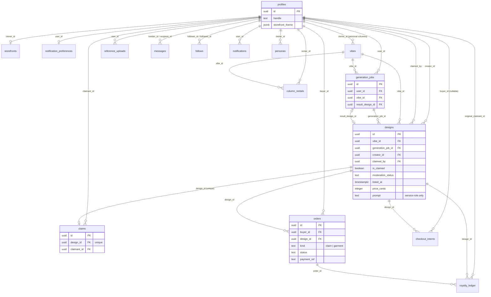

# Data Model

Grounded in `supabase/migrations/` as of `20260831054753_design_back_mockup_grant.sql`
(the baseline file `20260811034201_baseline_schema.sql` is itself a squash of the
first eighteen migrations — everything below reads that squash plus the seven
migrations that landed after it, in order, as one final schema). Cross-checked
against `lib/data/*.ts` and the write paths in `app/**`.

## Overview

Postgres (Supabase), schema `public`, RLS enabled on every table. One `auth.users`
row per account; `public.profiles` is the 1:1 public-facing record a trigger
creates automatically on signup.

The shape of the product: a maker generates AI shirt designs (`generation_jobs` →
`designs`), lists the ones they want to sell, and anyone can **claim** one —
claiming *is* buying, at the design's own price, and transfers permanent
ownership plus a personal **storefront** in one atomic step. Claimed designs can
then be ordered as physical garments through Printify (`orders` with
`kind = 'garment'`), fulfilled via a Bolt-hosted checkout. `designs` is the
central table — nearly every other table hangs off it directly or by way of
`generation_jobs`/`orders`/`claims`.

Two access-control mechanisms recur throughout and are worth knowing before
reading the per-table RLS:

- **Row-level security** — the standard mechanism, described per table below.
- **Column-level grants on `public.designs`** — `designs` additionally has its
  table-level `SELECT` grant revoked from `anon`/`authenticated` and replaced
  with an explicit per-column grant naming every column *except* `prompt`
  (`20260824120000_hide_prompt_column.sql`). This means `select("*")` no longer
  works against `designs` for those roles (PostgREST 401s), every query must
  name columns, and **a column added to `designs` after that migration is
  invisible to the browser until a follow-up `grant select (col) on
  public.designs to anon, authenticated` is run** — which is exactly what
  `20260831054753_design_back_mockup_grant.sql` does for `back_mockup_url`.
  `prompt` itself is service-role-only, forever.

## Entities

### `profiles`
One row per signed-up user, auto-created by a trigger on `auth.users` insert.

| Column | Type | Notes |
|---|---|---|
| `id` | uuid PK | = `auth.users.id`, `on delete cascade` |
| `handle` | text | unique, not null. Seeded as `user_<8 hex>`, user-editable later |
| `display_name` | text | nullable |
| `avatar_url` | text | nullable |
| `bio` | text | nullable |
| `banner_url` | text | nullable — storefront banner |
| `storefront_theme` | jsonb | nullable — AI-generated theme tokens, shape owned by `lib/storefront/theme.ts` (`parseTheme`); `NULL` = house style |
| `created_at` | timestamptz | default `now()` |

**RLS:** `profiles_select_own` (own row, authenticated) + `profiles_select_public`
(`using (true)` — every column, including `bio`/`banner_url`/`storefront_theme`,
is public; unlike `designs` there is no column-level carve-out) + `profiles_update_own`.

A `security_invoker` view **`public_profiles`** (`id, handle, display_name,
avatar_url`) re-exposes the same public columns for callers that want a
narrower shape (used by `lib/data/messages.ts`).

### `vibes`
The curated "columns"/categories designs are filed under (also creator-owned
personal columns via `owner_id`).

| Column | Type | Notes |
|---|---|---|
| `id` | uuid PK | default `gen_random_uuid()` |
| `name` | text | not null |
| `slug` | text | unique, not null |
| `is_default_column` | boolean | not null, default `true` — house column vs. a creator's personal one |
| `owner_id` | uuid FK → `profiles(id)` | nullable |
| `created_at` | timestamptz | default `now()` |

**RLS:** `vibes_select_public` only. No insert/update/delete policy — curated,
service-role only.

**Index:** `vibes_owner_id_idx`.

### `reference_uploads`
Images a maker uploads as generation reference material.

| Column | Type | Notes |
|---|---|---|
| `id` | uuid PK | |
| `user_id` | uuid FK → `profiles(id)` | not null, `on delete cascade` |
| `image_url` | text | not null |
| `created_at` | timestamptz | default `now()` |

**RLS:** `reference_uploads_owner_all` — full CRUD, owner only.
**Index:** `reference_uploads_user_id_idx`.

### `generation_jobs`
One AI generation request/run.

| Column | Type | Notes |
|---|---|---|
| `id` | uuid PK | |
| `user_id` | uuid FK → `profiles(id)` | not null, `on delete cascade` |
| `vibe_id` | uuid FK → `vibes(id)` | nullable |
| `reference_upload_ids` | uuid[] | not null, default `'{}'` |
| `quality_tier` | text | not null, check in `('low','medium','high')` — originally `('draft','upscale')`, migrated in place |
| `status` | text | not null, check in `('queued','generating','done','failed')`, default `'queued'` |
| `result_design_id` | uuid FK → `designs(id)` | first of the (typically four) images the job produced |
| `style_slug` | text | nullable — which `STYLE_PRESETS` entry was used |
| `text_content` | text | nullable — the arched title text for typographic styles |
| `quote_content` | text | nullable — the line under the illustration, for illustrated styles |
| `created_at` | timestamptz | default `now()` |

**RLS:** `generation_jobs_owner_all` (full CRUD, owner only) is the **only**
policy left standing. A second policy, `generation_jobs_select_public_result`,
briefly made a job publicly readable once it produced a listed design — it was
added in one migration and **dropped two migrations later**
(`20260809140315_design_ownership_listing.sql` §5) on the reasoning that
`designs.creator_id` now answers "who made this" without it. See **Mismatches**
below — the app still expects a public read here.

**Indexes:** `generation_jobs_user_id_idx`, `generation_jobs_vibe_id_idx`.

### `designs` — the central table
An AI-generated design: artwork, listing state, ownership, and Printify
product state, all on one row.

| Column | Type | Notes |
|---|---|---|
| `id` | uuid PK | |
| `vibe_id` | uuid FK → `vibes(id)` | nullable |
| `generation_job_id` | uuid FK → `generation_jobs(id)` | nullable |
| `image_url` | text | not null — flat artwork. Never sent to the browser directly (see below) |
| `print_ready_front_url` | text | nullable |
| `print_ready_back_url` | text | nullable |
| `is_claimed` | boolean | not null, default `false` |
| `claimed_by` | uuid FK → `profiles(id)` | nullable |
| `moderation_status` | text | not null, check in `('pending','approved','rejected')`, default `'pending'` |
| `price_cents` | integer | nullable (was `not null default 2900`, relaxed once free listings shipped); check `price_cents is null or price_cents > 0`. `NULL` = maker chose free, distinct from "never priced" |
| `prompt` | text | nullable — the maker's raw idea. **Not readable by `anon`/`authenticated`** (column grant revoked); service role only |
| `printify_product_id` | text | nullable — doubles as the "synced?" marker |
| `mockup_url` | text | nullable — Printify photo of the front (or back, if back-only) |
| `back_mockup_url` | text | nullable — Printify photo of the back print, only meaningful for `placement = 'both'` |
| `creator_id` | uuid FK → `profiles(id)` | nullable — who generated it. Paid once at claim, no ongoing rights |
| `listed_at` | timestamptz | nullable — `NULL` = private draft or delisted |
| `garment_slug` | text | nullable — which configured Garment it was minted on; `NULL` = default |
| `featured_variant_id` | integer | nullable — representative variant for the hero mockup photo (not what a buyer must purchase) |
| `placement` | text | nullable, check in `('front','back','both')` |
| `is_prompt_hidden` | boolean | not null, default `false` — creator toggle, independent of the hard RLS/grant block on `prompt` |
| `title` | text | nullable — 5-7 word name, written by the composer alongside `prompt` |
| `original_image_url` | text | nullable — pre-background-removal artwork, set the first time bg removal runs |
| `description` | text | nullable — buyer-facing blurb, written by the composer |
| `created_at` | timestamptz | default `now()` |

**Constraints:** `designs_price_cents_positive`; `placement` check;
`moderation_status` check.

**Indexes:** `designs_vibe_id_idx`, `designs_generation_job_id_idx`,
`designs_claimed_by_idx`, `designs_is_claimed_idx`, `designs_creator_id_idx`,
`designs_listed_at_idx` (partial, `where listed_at is not null`).

**RLS:**
- `designs_select_listed` — `listed_at is not null or auth.uid() = creator_id or
  auth.uid() = claimed_by`. Anon carries `auth.uid() = null`, so this collapses
  to "listed only" for signed-out visitors; a maker still sees their own drafts,
  an owner still sees what they delisted.
- `designs_update_creator_unclaimed` — maker can update **only** while
  `claimed_by is null`; the instant a design is claimed this policy stops
  matching (both `USING` and `WITH CHECK`, so a maker can't reassign
  `creator_id`/`claimed_by` either).
- `designs_update_claimant` — the current owner can update their own claimed row.
- **No client INSERT policy at all** — rows are only ever created server-side
  (service role) from `app/api/generate/route.ts`.

Buyer-facing note (not schema, but load-bearing for how `image_url` is used):
`lib/images/design-src.ts` never lets `image_url` reach the browser directly —
every card/detail view routes through `/api/design-image/[id]`, which serves a
watermarked/capped version to everyone except the owner and maker.

### `claims`
The permanent record of a design's ownership transfer.

| Column | Type | Notes |
|---|---|---|
| `id` | uuid PK | |
| `design_id` | uuid FK → `designs(id)` | not null, **unique** — one claim per design, ever |
| `claimant_id` | uuid FK → `profiles(id)` | not null |
| `claimed_at` | timestamptz | default `now()` |

**RLS:** `claims_select_public` only. Rows are inserted exclusively by the
`claim_design`/`claim_design_for` SECURITY DEFINER functions (see **Functions**).

**Index:** `claims_claimant_id_idx`.

### `storefronts`
A claimant's public shop page, auto-provisioned on their first claim.

| Column | Type | Notes |
|---|---|---|
| `id` | uuid PK | |
| `owner_id` | uuid FK → `profiles(id)` | not null, **unique**, `on delete cascade` — one storefront per person |
| `slug` | text | unique, not null (= the owner's handle at creation time) |
| `created_at` | timestamptz | default `now()` |

**RLS:** `storefronts_select_public` only. Rows are created only by
`claim_design_for` (`on conflict (owner_id) do nothing`).

### `follows`
Creator following.

| Column | Type | Notes |
|---|---|---|
| `follower_id` | uuid FK → `profiles(id)` | `on delete cascade` |
| `followed_id` | uuid FK → `profiles(id)` | `on delete cascade` |
| `created_at` | timestamptz | default `now()` |

**PK:** `(follower_id, followed_id)`. **Check:** `follows_no_self_follow`
(`follower_id <> followed_id`).

**RLS:** `follows_select_public`, `follows_insert_own` (`auth.uid() =
follower_id`), `follows_delete_own`.

**Index:** `follows_followed_id_idx`.

### `column_rentals`
Paid takeovers of a feed column for a time window.

| Column | Type | Notes |
|---|---|---|
| `id` | uuid PK | |
| `renter_id` | uuid FK → `profiles(id)` | not null |
| `vibe_id` | uuid FK → `vibes(id)` | not null |
| `starts_at` / `ends_at` | timestamptz | not null; check `column_rentals_valid_window` (`ends_at > starts_at`) |
| `created_at` | timestamptz | default `now()` |

**RLS:** `column_rentals_select_public` only — writes are service-role only.
**Indexes:** `column_rentals_renter_id_idx`, `column_rentals_vibe_id_active_idx`
(`vibe_id, starts_at, ends_at`, for the "is this column rented right now" scan).

### `orders`
Two things share this table, told apart by `kind`: buying **ownership** of a
design (`kind = 'claim'`) and buying a **printed garment** of one you already
own (`kind = 'garment'`).

| Column | Type | Notes |
|---|---|---|
| `id` | uuid PK | |
| `buyer_id` | uuid FK → `profiles(id)` | not null |
| `design_id` | uuid FK → `designs(id)` | not null |
| `kind` | text | not null, default `'claim'`, check in `('claim','garment')` |
| `quality_tier` | text | nullable, legacy — unused by the current garment-order flow |
| `placement_front` / `placement_back` | boolean | not null, defaults `true`/`false` |
| `size` | text | nullable |
| `variant_id` | integer | nullable — Printify variant purchased |
| `amount_cents` | integer | not null (no positivity check — a free claim records `0`) |
| `payment_ref` | text | nullable — Bolt transaction reference; renamed from `stripe_payment_intent_id` when Stripe was replaced by Bolt. `NULL` for a free claim |
| `printify_order_id` | text | nullable |
| `printify_status` | text | nullable — Printify's raw status word; `status` below is a coarse mapping of it |
| `status` | text | not null, check in `('pending','paid','fulfilled','refunded')`, default `'pending'` |
| `ship_first_name`, `ship_last_name`, `ship_email`, `ship_phone`, `ship_country`, `ship_region`, `ship_address1`, `ship_address2`, `ship_city`, `ship_zip` | text | nullable — address **snapshot** at order time, never written back to `profiles`. PII; buyer-only under RLS; no retention policy |
| `created_at` | timestamptz | default `now()` |

**Unique index (partial):** `orders_payment_ref_key` on `payment_ref` where not
null — the actual idempotency guard against a webhook firing twice, not just a
"check then insert" in application code.
**Index:** `orders_kind_idx`.

**RLS:** `orders_select_own` only (`auth.uid() = buyer_id`). No client
insert/update policy — every write goes through `claim_design_for` (claim
orders) or service-role code (garment-order creation, Printify status
refresh in `lib/data/orders.ts`).

A trigger, `notify_on_order_status_change`, fires a notification to the buyer
whenever `status` changes.

### `pod_provider_mapping`
| Column | Type | Notes |
|---|---|---|
| `quality_tier` | text PK | |
| `provider_key` | text | not null |

**RLS:** enabled, **zero policies** — default-deny for every role including
service-role reads through PostgREST (service role bypasses RLS entirely, so
it can still read/write via a direct connection). See **Mismatches** — no
application code references this table at all.

### `royalty_ledger`
Per-design royalty accrual/payout record.

| Column | Type | Notes |
|---|---|---|
| `id` | uuid PK | |
| `order_id` | uuid FK → `orders(id)` | not null |
| `design_id` | uuid FK → `designs(id)` | not null |
| `original_claimant_id` | uuid FK → `profiles(id)` | not null |
| `amount_cents` | integer | not null |
| `paid_at` | timestamptz | nullable — unpaid until set |
| `created_at` | timestamptz | default `now()` |

**RLS:** `royalty_ledger_select_own` only (`auth.uid() = original_claimant_id`).
No insert policy for clients, and — see **Mismatches** — no service-role writer
in the codebase either.

**Indexes:** `royalty_ledger_order_id_idx`, `royalty_ledger_design_id_idx`,
`royalty_ledger_original_claimant_id_idx`.

A trigger, `notify_on_royalty`, notifies the claimant on insert and again when
`paid_at` transitions from null to set.

### `messages`
Direct messages between two users.

| Column | Type | Notes |
|---|---|---|
| `id` | uuid PK | |
| `sender_id` | uuid FK → `profiles(id)` | not null |
| `recipient_id` | uuid FK → `profiles(id)` | not null |
| `body` | text | not null |
| `read_at` | timestamptz | nullable |
| `created_at` | timestamptz | default `now()` |

**RLS:** `messages_select_participant` (sender or recipient) and
`messages_insert_as_sender` (`auth.uid() = sender_id`). **No UPDATE policy
exists for this table at all** — see **Mismatches**, this is load-bearing.

**Indexes:** `messages_recipient_id_idx`, `messages_sender_id_idx`.

A trigger, `notify_on_message`, notifies the recipient on insert (gated by
their `notification_preferences.notify_messages`).

### `newsletter_subscribers`
| Column | Type | Notes |
|---|---|---|
| `id` | uuid PK | |
| `email` | text | unique, not null |
| `created_at` | timestamptz | default `now()` |

**RLS:** `newsletter_subscribers_insert_public` (insert, `anon` + `authenticated`,
`with check (true)`). No select policy — write-only from the client; nobody can
list subscribers except the service role.

### `notification_preferences`
One row per user, auto-created alongside their profile.

| Column | Type | Notes |
|---|---|---|
| `user_id` | uuid PK, FK → `profiles(id)` | `on delete cascade` |
| `notify_claims`, `notify_royalties`, `notify_messages`, `notify_orders` | boolean | not null, default `true` |
| `updated_at` | timestamptz | default `now()` |

**RLS:** `notification_preferences_select_own`, `notification_preferences_update_own`.

### `notifications`
| Column | Type | Notes |
|---|---|---|
| `id` | uuid PK | |
| `user_id` | uuid FK → `profiles(id)` | not null, `on delete cascade` |
| `type` | text | not null, check in `('claim','royalty','message','order')` |
| `title` | text | not null |
| `body` | text | nullable |
| `link` | text | nullable |
| `read_at` | timestamptz | nullable |
| `created_at` | timestamptz | default `now()` |

**RLS:** `notifications_select_own`, `notifications_update_own`. No client
insert policy — rows are written exclusively by the four `notify_on_*` SECURITY
DEFINER trigger functions.

**Indexes:** `notifications_user_id_created_at_idx` (`user_id, created_at
desc`), `notifications_user_id_unread_idx` (partial, `where read_at is null`).

### `checkout_intents`
What was known about a buyer at the moment they were sent to Bolt Checkout —
replaces stashing name/email in the payment processor's session metadata.

| Column | Type | Notes |
|---|---|---|
| `order_reference` | text PK | minted by the app, sent as Bolt's `order_reference`, read back off the webhook |
| `design_id` | uuid FK → `designs(id)` | not null |
| `buyer_id` | uuid FK → `profiles(id)` | nullable — null for a guest; the account is minted at fulfilment |
| `buyer_name` | text | not null |
| `buyer_email` | text | not null |
| `expected_cents` | integer | not null — what the buyer was shown, compared against (never trusted as) the amount Bolt reports |
| `created_at` | timestamptz | default `now()` |

**RLS:** enabled, **zero policies** — service role only (`app/api/bolt/webhook/route.ts`).
**Index:** `checkout_intents_design_idx`.

### `personas`
A maker's own derived style, from 20-50 liked reference designs — distinct
from the static style presets, folded into generation as a soft voice layer.

| Column | Type | Notes |
|---|---|---|
| `id` | uuid PK | |
| `owner_id` | uuid FK → `profiles(id)` | not null, `on delete cascade` |
| `name` | text | not null |
| `style_summary` | text | not null — vision-model output |
| `reference_image_urls` | text[] | not null |
| `created_at` | timestamptz | default `now()` |

**RLS:** owner-only select, insert, delete (three separate policies, each
`auth.uid() = owner_id`). No update policy — matches app usage, which only
creates and deletes personas, never edits one in place.

### Functions (SECURITY DEFINER, `search_path = ''`)
- **`handle_new_user()`** — trigger on `auth.users` insert; creates the
  matching `profiles` row.
- **`handle_new_profile()`** — trigger on `profiles` insert; creates the
  matching `notification_preferences` row.
- **`notify_on_message()` / `notify_on_claim()` / `notify_on_royalty()` /
  `notify_on_order_status_change()`** — the four notification triggers.
  `EXECUTE` explicitly revoked from `public`/`anon`/`authenticated` (Postgres
  grants `EXECUTE` on new functions by default; these are trigger-only).
- **`claim_design(p_design_id, p_expected_cents, p_payment_ref)`** — thin
  session-bound wrapper; resolves `auth.uid()` and delegates to
  `claim_design_for`. Granted to `authenticated` only.
- **`claim_design_for(p_buyer_id, p_design_id, p_expected_cents,
  p_payment_ref)`** — the real transaction: row-locks the design (`for update`),
  validates approved/listed/unclaimed/not-your-own-design/price-matches, inserts
  the `orders` row, flips `designs.is_claimed`/`claimed_by`, inserts `claims`,
  and provisions `storefronts` (`on conflict (owner_id) do nothing`) — all one
  atomic unit. Exists as a separate function because Bolt's webhook confirms
  payment with no buyer session (no `auth.uid()`) to hang the claim off. Granted
  to `service_role` only, explicitly revoked from `anon`/`authenticated`.

## Storage Buckets

One bucket, `designs` (`public: true`), created in
`20260806000000_designs_storage_bucket.sql`:

- **Public read** for everything in the bucket — `designs_public_read` policy,
  `using (bucket_id = 'designs')`. The marketplace catalogue is public by
  design.
- **No general client write.** Design artwork itself is uploaded server-side
  (service role) from the generation route — there is deliberately no
  insert/update policy for ordinary uploads.
- **One narrow exception:** `persona_refs_owner_insert`
  (`20260827000000_persona_refs_owner_upload.sql`) lets an authenticated user
  `INSERT` directly into `storage.objects` when `bucket_id = 'designs'` **and**
  the object path is `persona-refs/<their own auth.uid()>/...`. This exists
  because persona reference uploads (10-50 full-res images) blow past Vercel's
  hard 4.5MB Server Action payload cap — the browser uploads straight to
  Storage under its own session, and `createPersona()`
  (`app/dashboard/personas/actions.ts`) re-validates every URL actually falls
  under that same prefix before trusting it.

No other buckets exist in the migrations or in `lib/images`/`lib/supabase`.

## Relationships

## Notable Constraints / Business Rules Encoded in Schema

- **A design can be claimed exactly once.** Enforced two ways: `claims.design_id`
  is `unique`, and `claim_design_for` takes a row lock (`for update`) on the
  design before checking `is_claimed`/`claimed_by`, so two concurrent claims
  cannot both pass.
- **Claiming is atomic and ownership-transferring.** One SECURITY DEFINER
  function inserts the order, flips the design, inserts the claim, and
  provisions the storefront — never separate client-side writes, because
  `designs`/`claims`/`storefronts`/`orders` have no client insert policy for
  this path at all.
- **A maker cannot claim their own design** (`creator_id = buyer` check in
  `claim_design_for`), and **house stock has no maker to exclude**
  (`creator_id is null` makes the comparison null, so the branch doesn't fire).
- **Price is re-validated at claim time, not trusted from the client**:
  `p_expected_cents` must match the row's current `price_cents` (`is distinct
  from`, so free-vs-free compares correctly) — a maker editing the price
  mid-checkout fails the claim rather than silently charging a stale amount.
- **Generation stops being publication.** A design is private to its creator
  until `listed_at` is set; `designs_select_listed` is the actual privacy
  boundary (RLS, not an app-level filter) because `designs` is read straight
  from the browser with the anon key.
- **Ownership ends control.** The instant `claimed_by` is set, the maker's
  update policy (`designs_update_creator_unclaimed`) stops matching — enforced
  by `WITH CHECK`, not just `USING`, so a maker can't reassign the row to dodge
  it either.
- **A garment product, once minted, is permanent for that design.**
  `printify_product_id` is the sync marker; `lib/printify/sync.ts` no-ops once
  it's set (re-minting would orphan the existing Printify product), so
  `garment_slug`/`placement` are effectively frozen after first sync.
- **Money is integer cents everywhere**, never float — `price_cents`,
  `amount_cents`, `expected_cents`.
- **Free vs. never-priced is a real distinction**: `price_cents is null` after
  the ownership-listing migration means "the maker chose free," not "nobody
  decided" — the `not null default 2900` was deliberately dropped.
- **`prompt` is the one column in the schema that is genuinely private**: not
  RLS-gated (RLS is row-level) but column-grant-gated — the only place in this
  schema where PostgREST's column-privilege enforcement is load-bearing instead
  of RLS.
- **Payment idempotency is a unique index, not application logic**:
  `orders_payment_ref_key` (partial, non-null) is what actually stops a
  double-fired webhook from creating two paid orders for one transaction.

## Mismatches Between Schema and Code Usage

Flagged, not fixed, per the task:

1. **`generation_jobs` has no public read policy, but `lib/data/design.ts`
   `getDesignDetail()` relies on one.** The detail page joins
   `generation_jobs → profiles` (for the creator box: handle, display name,
   avatar, bio) and reads `quote_content` off the same row, for *any* visitor —
   but the only RLS policy left on `generation_jobs` is `generation_jobs_owner_all`
   (owner-only). The public-read policy that used to cover this
   (`generation_jobs_select_public_result`) was explicitly dropped in
   `20260809140315_design_ownership_listing.sql` on the stated reasoning that
   `designs.creator_id` replaced the need for it — but `creator_id` only gives
   an id, not the joined profile fields or `quote_content`, and `design.ts`
   still does the join. Because this runs through the normal (non-service-role)
   server client, the query doesn't error — RLS just filters it to zero rows
   for anyone but the job's owner, so `creator` renders `null` and `quote`
   renders `null` on every design page viewed by someone other than its maker.
   Worth confirming whether the creator box/quote are actually rendering in
   production for other users' designs, or whether this has been silently
   broken since that migration.

2. **`messages` has no UPDATE policy at all**, but `lib/data/messages.ts`
   `getThread()` calls `supabase.from("messages").update({ read_at: ... })`
   through the normal user-session client to mark incoming messages read.
   With no update policy, RLS default-denies the write — it fails silently (0
   rows affected, no thrown error), so `read_at` never actually gets set this
   way and `unreadCount` on the inbox can never clear through this path.

3. **`royalty_ledger` has a full read surface (dashboard, settings, home
   stats) and a notification trigger (`notify_on_royalty`), but nothing in the
   codebase writes to it.** No client insert policy exists (correct — royalties
   shouldn't be client-writable), but there's also no service-role insert
   anywhere in `app/**` or `lib/**`. The royalty UI is fully wired to display
   data that nothing currently produces — either a secondary-sale/royalty
   mechanic hasn't shipped yet, or it's populated by a process outside this
   repo (manual, external cron, edge function not in `supabase/migrations`).

4. **`pod_provider_mapping` is defined with RLS and no policies (service-role
   only, as intended) but is never referenced anywhere in `app/**` or
   `lib/**`.** Either dead schema left over from an earlier pricing-tier design
   (see the `generation_jobs.quality_tier` rename from `draft/upscale` to
   `low/medium/high`, which suggests the tier concept was reworked), or it's
   populated/read by tooling outside this repo.
